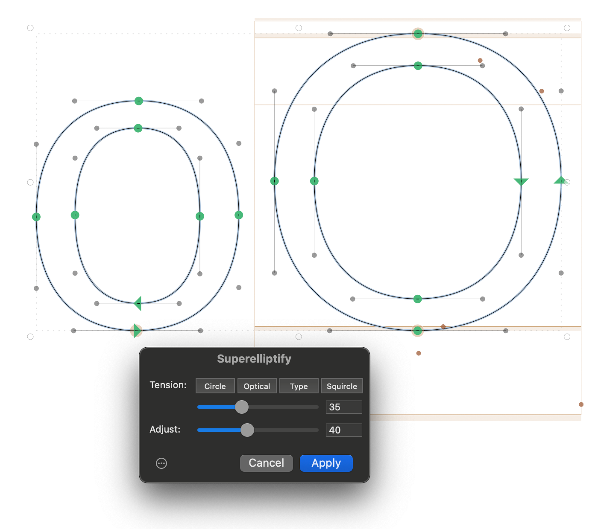
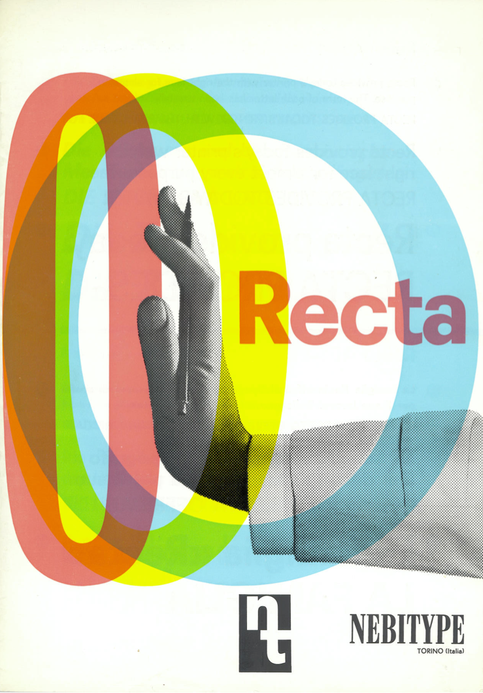
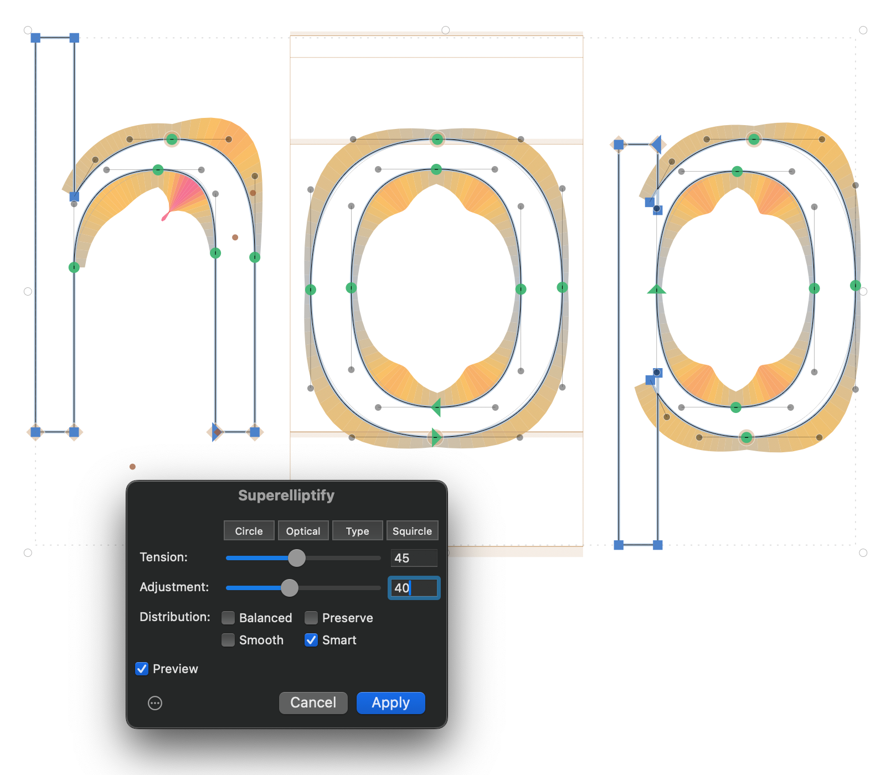
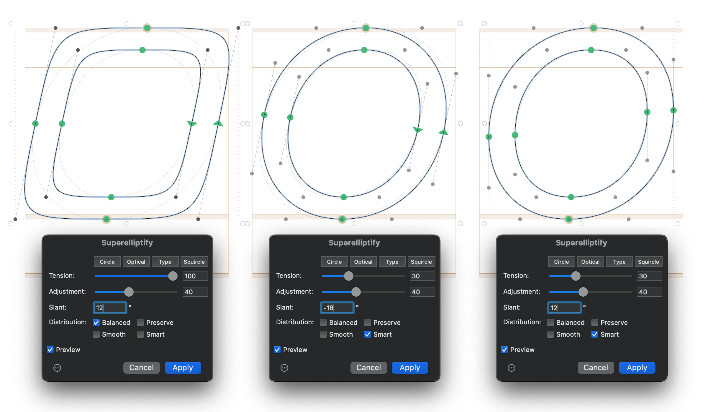

# Superelliptify

A filter plugin for [Glyphs 3](https://glyphsapp.com) that adjusts cubic Bézier curve handles along the circle–squircle approximation spectrum using the Tension parameter.

The optional Adjustment parameter allows for adaptive curve Tension application that follows segment geometry. It increases Tension for more oblong shapes, reflecting a pattern found across many typefaces and font families.

The algorithm scales its effect to the turning angle of each segment. Shorter curve segments receive proportionally less change, preserving shapes defined by deliberately placed on-curve points. This allows for less destructive application to multiple shapes at once (e.g. for prototyping).



Based on a custom algorithm designed in 2015 by Maciej Ratajski.

## What it does

Superelliptify controls how "round" or "square" your curves are by adjusting off-curve handle lengths. It works across the range from circle (~55% for a 90° arc) to squircle (100% handles for a 90° arc).

Two parameters:

- **Tension** (0–100) — controls the superellipticity. 0 = exact circle approximation, 13 = optically correct circle, 20 = a good default for type design, 100 = full squircle.
- **Adjustment** (0–100) — eccentricity compensation. At higher values, more oblong shapes are pushed further toward squircle-like forms. This reflects a pattern observed across many typefaces: narrow shapes tend to resemble rounded rectangles rather than squished circles.

Preset buttons for quick access: **Circle · Optical · Type · Squircle**

A specific balance of the two parameters can be applied among multiple glyphs of the same font family.



## Distribution modes

After computing new handle lengths, the plugin offers four distribution modes that control how handles and nodes are arranged:

- **Balanced** — Default. Distributes handle lengths equally on both sides of each segment. On-curve points stay fixed.
- **Preserve** — Applies the same overall tension but restores the designer's original handle-length ratio within each segment. Useful when the original imbalance was intentional.
- **Smooth** — Balanced tension plus G2 curvature continuity at smooth nodes. Adjusts handle lengths at junctions between segments so curvature flows without breaks.
- **Smart** — Balanced tension with handles fixed in place, then moves on-curve smooth nodes to achieve G2 continuity. Produces the cleanest handle positions at the cost of slightly shifting node locations.



## Slant compensation for italics

The **Slant** parameter (-45° to 45°) makes Superelliptify work better on slanted and italic letterforms. Setting it to the same angle as the slanted glyphs produces results equivalent to superelliptifying upright contours and slanting them afterwards (thus introducing similar problems to slanting the upright contours).

For shapes with slanted "italic extremes", using a negative value of roughly 1.5× the actual italic angle, combined with Smart distribution, pushes slanted ovals closer to the optically corrected target. So if your font uses an italic angle of 12°, you might want to try setting Slant to around -18° and see if this helps you get in the right ballpark.

For shapes with correctly placed upright horizontal extremes, using the same Slant value as the italic angle in combination with Smart distribution should produce best results.



## Key properties of the algorithm

- Uses the Bézier circle approximation as its mathematical baseline, generalized to any segment angle
- Preserves shapes with user-placed on-curve points — segments with small turning angles receive minimal adjustment
- Eccentricity-aware: the Adjustment parameter makes oblong shapes trend toward rounded-rectangle forms, matching the stylistic consistency found in many real typefaces
- Works on selected segments, whole glyphs, or across multiple glyphs, whole fonts, and font families
- Can be used as a Custom Parameter on export for quick prototyping
- Preview toggle for quick before/after comparison in the edit view

## Installation

Double-click `Superelliptify.glyphsFilter` to install, or copy it to:

```
~/Library/Application Support/Glyphs 3/Plugins/
```

Restart Glyphs after installing.

## Usage

**Filter menu** → **Superelliptify**

Select curve segments (or select all), adjust the sliders, set the slant angle if working with italics, choose a distribution mode, and click Apply. Use the Preview checkbox to toggle before/after in the edit view.

**As a Custom Parameter** (for export instances):

```
Superelliptify; tension:20; adjustment:50
Superelliptify; tension:20; adjustment:50; slant:12
Superelliptify; tension:20; adjustment:50; slant:12; distribution:preserve
Superelliptify; tension:20; adjustment:50; distribution:smooth
Superelliptify; tension:20; adjustment:50; slant:-18; distribution:smart
```

Slant defaults to 0 when omitted. Distribution defaults to balanced when omitted.

## Algorithm

Algorithm designed in 2015 by Maciej Ratajski.

Plugin structure informed by the [Curve Equalizer](https://github.com/jenskutilek/Curve-Equalizer) by Jens Kutilek.

Smart distribution mode uses the harmonization algorithm by [Simon Cozens](https://gist.github.com/simoncozens/3c5d304ae2c14894393c6284df91be5b), as implemented in [Green Harmony](https://github.com/mekkablue/GreenHarmony) by Alex Slobzheninov and Rainer Erich Scheichelbauer (Apache-2.0).

## License

MIT
